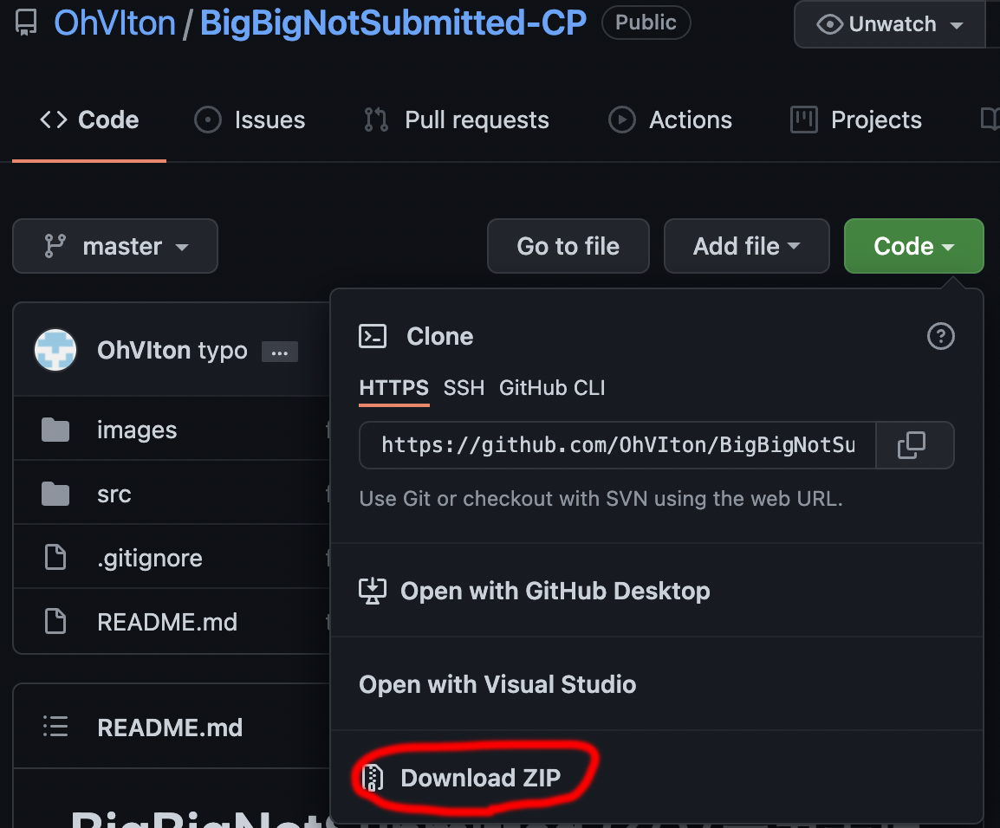
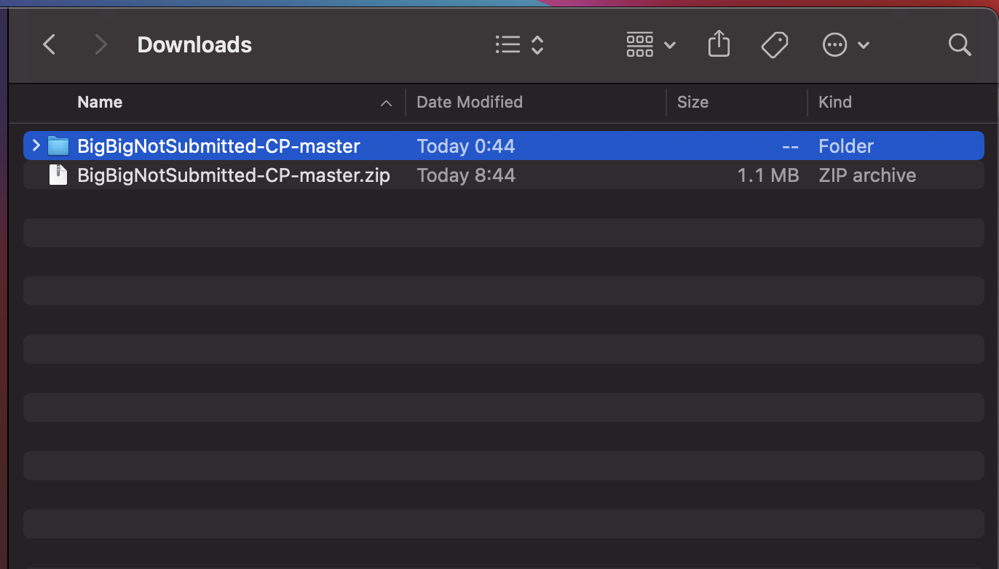
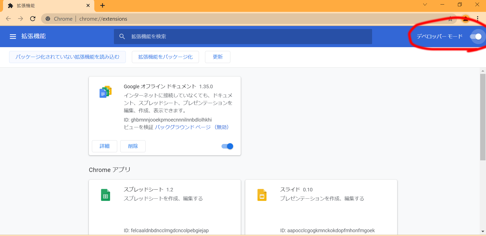
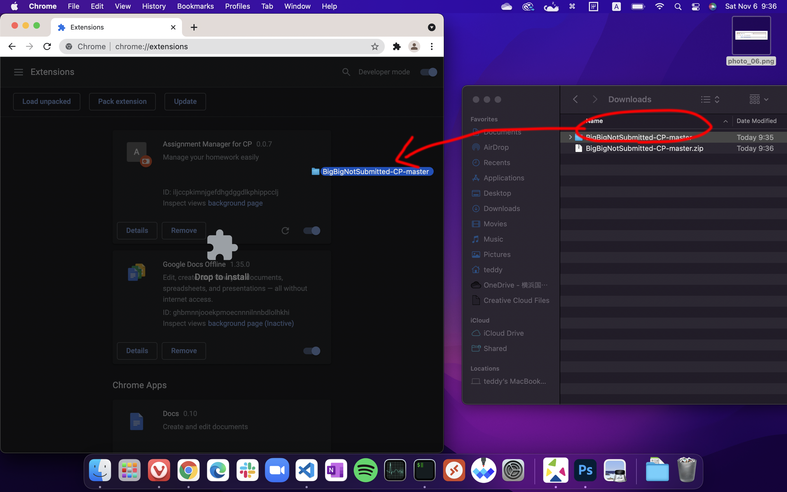
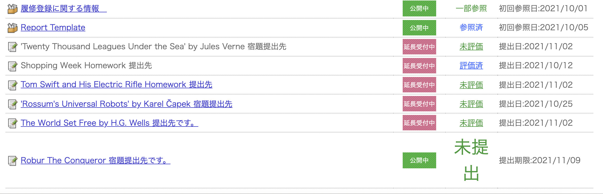
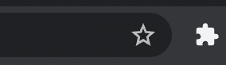
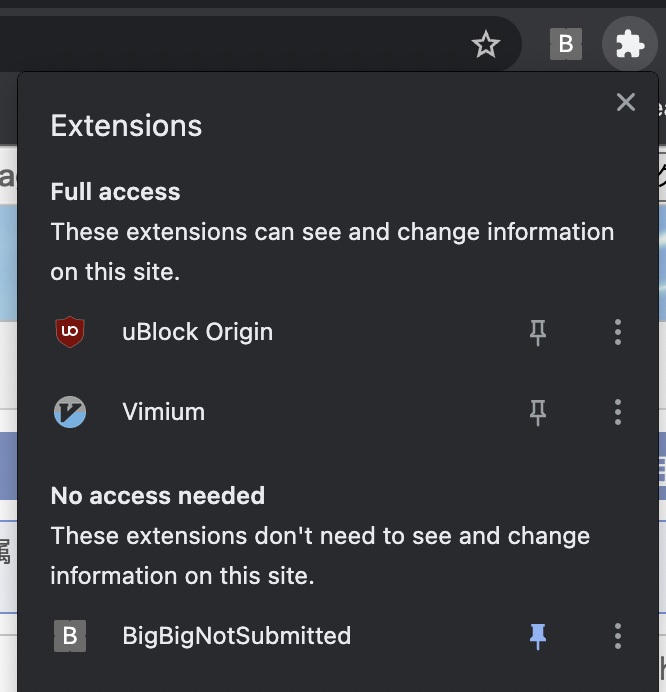
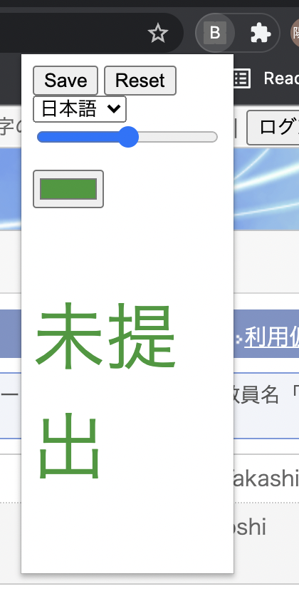
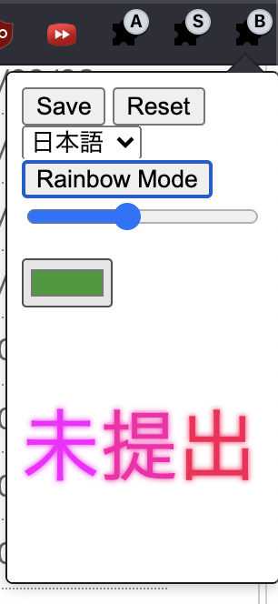

# BigBigNotSubmitted (クソデカ未提出)

未提出と未評価の色が一緒で見分けづらい問題を、未提出を大きくすることで解決します。   
未提出の文字の大きくするサイズの変更、色の変更もできます。    
English Supported!  
クソデカ未回答は要望があれば対応します  
[課題管理のやつ](https://github.com/OhVIton/Assignment-Management-CPと共存できます)と共存できます
## インストール方法
Code → Download ZIPを押してダウンロードします  
  
ダウンロードしたファイルを右クリック→すべて展開(Windows)か、ダブルクリックで展開(Mac)してください  
  
  
次に、Chromeを開き、アドレスバーに[chrome://extensions](chrome://extensions)と入力し、アクセスします。一番右にある３つ点が縦に並んだやつ→その他のツール→拡張機能でもいいです。 
  
以下の画面が開いたら、右上にあるデベロッパーモードをクリックして有効化してください  
  
そして、「パッケージ化されていない拡張機能を読み込む」をクリックして、

ダウンロードしたフォルダ内の*srcフォルダ*を読み込みます  

これで完了。おめでとう。

  
## 使用方法
インストール後講義ページを開くと、未提出の文字がもう大きくなっていることがわかると思います  
デフォルトでは15pxの2倍の30pxに設定してあります。

また、Chromeのアドレスバーの右のとこの拡張機能ボタン押して  
  
BigBigNotSubmittedをピン留めした後、
  
アイコンをクリックすれば、未提出の文字のサイズ、色も指定できます  
プレビューも下に表示されます (日本語/Englishはプレビュー用)  
設定後Saveボタンをクリックし画面更新すれば反映されます。Resetボタンを押せば元(15px, #339933)に戻ります  
  
また、Rainbow Modeを押せば、未提出が七色に光ります  
  

## サーバー負荷について
ブラウザ上でテキストをいじるだけなので、追加のサーバー負荷は皆無と思われます。
